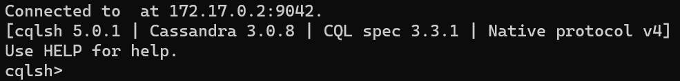

# ETL Transforming Script (Local Demo)

This is a script made for the transforming part of my ETL made for my NoSQL lecture.

## What it is for?

This code answers questions that I have about an actual economy:

- How is the PIB doing inside the economy?

- How many transactions are being made of an specific items list a day? Which type of transaction?

- How can I compare the demand of these items with respect of the entire demand of objects?

## Installation

### Docker Way

Install [docker](https://docs.docker.com/engine/install/)

Clone the repo and cd to it

```bash
git clone https://github.com/SergioPereo/data_processor
cd data_processor
```

Then just run the docker compose file with

```bash
docker compose up
```

### Hard Way

I will asume ur working in an ubuntu environment. Feel free to change the steps for a different platform.

First we need to install [spark](https://medium.com/@patilmailbox4/install-apache-spark-on-ubuntu-ffa151e12e30) since it is needed for the processing part.

Clone de the repo and cd to it.

```bash
git clone https://github.com/SergioPereo/data_processor
cd data_processor
```

Install these packages in case you didn't already.

```bash
sudo apt install zip -y
sudo apt install gzip -y
sudo apt install tar -y
```

Download the zip from this [link](https://drive.google.com/file/d/1ZmXKz_2d84EUg6cDOAuQ8NeBCede2C_w/view?usp=sharing).
Place it in the project folder and extract it (it's around 1.7GB)

```bash
unzip data.zip -d ./ && rm data.zip
```

Use the package manager [pip](https://pip.pypa.io/en/stable/) to install requirements.txt

```bash
pip install -r ./requirements.txt
```

Install [docker](https://docs.docker.com/engine/install/) and create a volume (change <your volume> for any name you want for it (you can run the db without a volume but the data in the database will be deleted once the scylla container stops if that's what you want go ahead):

```bash
docker volume create <your volume>
```

Then run this command to start a scylladb service. You are going to need 4 free GB of RAM.

```bash
docker run --name datadb -p 9042:9042 --volume <your volume>:/var/lib/scylla --hostname datadb -d --rm scylladb/scylla --smp 1 --memory 4G
```

Run this instead if you don't want a volume
```bash
docker run --name datadb -p 9042:9042 --hostname datadb -d --rm scylladb/scylla --smp 1 --memory 4G
```

You can check if everything went fine by running

```bash
docker exec -it datadb cqlsh
```

If you see something like this you are ready to go:



## Usage

You just need to run the local processor file and it will process and load into scylla the approximated transactions found in the data. The data on the folder is just a bunch of market lookups with quantity and price. Each .json is a lookup at one time of the entire market. The transactions are approximated from the differences between contiguous lookups. To run the processor just run the following code:

### Docker way

Since we are working inside a docker environment. We need to enter to the dataprocessor service. For that you need to open a new terminal (cause the initial one is used by docker) and type

```bash
docker exec -it dataprocessor bash
```

The we need to position ourselves in the data_processor dir

```bash
cd data_processor
```

And finally just run the local_processor.py

```bash
python3 local_processor.py
```

This will start processing the files in data. Once the processor finished we can see the loaded data in scylla. For that we need to enter the scylla service using:

```bash
docker exec -it datadb cqlsh
```

Then we can see the created keyspace with the following command

```bash
describe keyspaces;
```

The created keyspace name is gmw_dw, to see the information inside him we run the following commands

```bash
use gmw_dw;
describe tables;
```

This will describe the tables inside the keyspace. There will be two tables: market and transactions. For now market is empty but transactions should be populated with the approximated transactions of the data folder. Have fun querying the data!


### Hard way

We need to run the processor first, so we need to run

```bash
python local_processor.py
```

This will start processing the files in data. Once the processor finished we can see the loaded data in scylla. For that we need to enter the scylla service using the following command:

```bash
docker exec -it datadb cqlsh
```

Then we can see the created keyspace with the following command

```bash
describe keyspaces;
```

The created keyspace name is gmw_dw, to see the information inside him we run the following commands

```bash
use gmw_dw;
describe tables;
```

This will describe the tables inside the keyspace. There will be two tables: market and transactions. For now market is empty but transactions should be populated with the approximated transactions of the data folder. Have fun querying the data :)